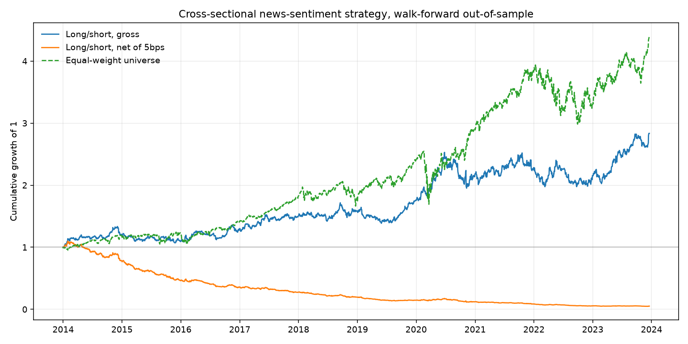

# NLP-Driven Financial Sentiment & Alpha Engine

An end-to-end quantitative research pipeline that collects financial news headlines,
scores them with a finance-specific transformer model (**FinBERT**), aligns the
resulting sentiment to tradable market sessions, and tests whether it predicts
cross-sectional equity returns.

It tests for a signal rigorously and reports that it did not find one.

---

## 📌 Headline result

> **No cross-sectional ranking signal with mean information coefficient above
> ~0.027 is present in 2018–2020 FNSPID headline sentiment across 47 large-cap US
> equities**, evaluated walk-forward with monthly refits over 365 out-of-sample
> sessions. Mean IC was **−0.0146 (t = −1.33)**. Five pre-registered configurations
> were tested; all five are reported and none reaches the Bonferroni-corrected
> threshold of |t| ≥ 2.5.

Published daily equity news signals typically run IC 0.01–0.03. This result
therefore rules out a **large** effect, not a small one — a distinction the power
analysis below makes explicit.



The most instructive finding is the gap between the two evaluations. A
dollar-neutral quintile long/short book returns **+7.8% annualized gross at
Sharpe +0.50**, which looks like an edge. It is not one:

| | Total | Annualized | Vol | Sharpe | Max DD |
|---|---|---|---|---|---|
| Long/short, gross | +11.5% | +7.8% | 18.3% | **+0.50** | −22.0% |
| Long/short, net of 5bps | −39.6% | −29.4% | 18.3% | **−1.81** | −51.2% |
| Equal-weight universe | +27.0% | +18.0% | 31.1% | +0.69 | −33.5% |

- **The entire gross return is one quarter.** Q2 2020 contributes +18.0%; excluding
  it the strategy returns **−4.7%**. Two of seven quarters are outright negative.
- **Turnover is 3.36× capital per session**, implying a 42% annual cost drag. A
  four-name-per-side book rebalanced daily rotates almost completely each day.
- **Passively holding the universe beat it** — at a higher Sharpe than the
  strategy's *gross* return.

The information coefficient weights every session equally; profit and loss weights
by magnitude. That is why a handful of violent sessions produced an apparently
positive backtest while the IC correctly reported nothing. Had only the backtest
been built, this project would have reported a false positive.

---

## 🧪 Pre-registered hypotheses

Both hypotheses were stated before any result was computed, and every
configuration is reported regardless of outcome.

- **H1 — surprise beats level.** Cross-sectional ranks describe how a stock's news
  compares with its peers but cannot express how it compares with the stock's own
  normal. The literature associates returns with *abnormal* attention and tone.
- **H2 — one day is too short.** Daily returns are dominated by microstructure
  noise; five days gives any genuine effect room to surface.

| Configuration | Rows | Accuracy | Edge vs baseline | Mean IC | IC sessions | t |
|---|---|---|---|---|---|---|
| H0 level / 1-day | 9,046 | 48.9% | −2.5% | −0.0146 | 365 | −1.33 |
| H1 surprise / 1-day | 8,868 | 49.9% | −1.4% | +0.0010 | 359 | +0.10 |
| H2 level / 5-day | 9,046 | 49.9% | −1.4% | −0.0013 | 73 | −0.05 |
| H1+H2 surprise / 5-day | 8,868 | 49.1% | −2.1% | +0.0120 | 72 | +0.45 |
| aux combined / 1-day | 8,868 | 49.4% | −1.9% | −0.0124 | 359 | −1.08 |

**Minimum detectable mean IC** at each configuration's sample size:

```
H0  level / 1-day        0.0274   (365 independent sessions)
H1  surprise / 1-day     0.0266   (359 independent sessions)
H2  level / 5-day        0.0714   ( 73 independent sessions)
```

H2's floor is high because the five-day IC series is strided by five sessions:
consecutive five-day returns share four of their five days, so an uncorrected
t-statistic would substantially overstate significance. H2 did not fail so much as
lack the power to succeed.

Testing stopped at five configurations. Continuing until something cleared the
threshold would have produced a number, not a finding.

---

## 🏗️ Architecture

```
scraper.py             RSS feeds ─────────▶ raw_news, news_tickers
backfill_news.py       FNSPID (streamed) ─▶ raw_news, news_tickers
sentiment_analyzer.py  unscored articles ─▶ sentiment_scores
build_features.py      yfinance ──────────▶ prices;  joined ─▶ daily_features
walkforward.py         daily_features ────▶ out-of-sample predictions
experiments.py         pre-registered hypothesis tests
backtest.py            predictions ───────▶ equity curve, cost analysis
app.py                 Streamlit dashboard
```

Every stage reads from and writes to SQLite, so stages are independent and
individually re-runnable. A stage that fails halfway leaves no partial state.

`migrate_csv.py` and the two CSV extracts in the repository root predate the
database. They are kept rather than deleted because the database file is not
version-controlled, so together they are the only recoverable copy of the earliest
live headlines, which have since rotated out of the source feed.

| Stage | Module | Status |
|---|---|---|
| News ingestion | `scraper.py` | ✅ Scheduled hourly |
| Historical backfill | `backfill_news.py` | ✅ 2018–2020, 35.5k headlines |
| Persistence layer | `database.py`, `schema.sql` | ✅ |
| Sentiment scoring | `sentiment_analyzer.py` | ✅ 37.2k headlines scored |
| Feature construction | `build_features.py` | ✅ 13.5k ticker-days |
| Model & evaluation | `alpha_engine.py`, `walkforward.py` | ✅ |
| Hypothesis tests | `experiments.py` | ✅ 5 configurations |
| Backtest | `backtest.py` | ✅ |
| Dashboard | `app.py` | ✅ |

**Current data:** 37,368 articles · 37,238 scored · 143,241 price bars
(2016–2026) · 57 tickers · 649 sessions.

---

## 🧠 Design notes

Five decisions account for most of the engineering, and each prevents a specific
way of arriving at a wrong answer.

### Point-in-time correctness

A headline published after the 16:00 ET close cannot inform a position entered at
that close. Attributing it to the session that just ended trains the model on
information that did not exist when the trade would have been placed — a lookahead
bias that inflates results while remaining invisible in every accuracy metric.

Each article stores both the raw UTC publication timestamp and a derived
`session_date`; news after the close, or outside the trading week, rolls to the
next session. When this was first applied to live data it reclassified **half** the
intraday feed output.

Because the raw timestamp is preserved rather than overwritten, adopting a
different execution assumption is a feature rebuild rather than a data migration.

### Articles are deduplicated, not ticker-headline pairs

The same article is frequently syndicated across several ticker feeds. Articles are
keyed by a SHA-256 hash of their canonicalized URL — query strings and tracking
parameters stripped — with a junction table mapping them to tickers, so each
headline is scored exactly once regardless of how many feeds carried it.

### Features are cross-sectionally normalized

Raw volume spans **799×** across this universe and headline counts **43×**. Raw
values therefore identify the company rather than describe the day, and an early
version of the model keyed on exactly that. Features are within-session percentile
ranks.

`sentiment_surprise` and `attention_surprise` measure each observation against the
ticker's own trailing baseline, computed from strictly prior observations —
`shift(1)` before the rolling window, without which each row would be compared
against a baseline containing itself.

### The target is market-relative

**55% of the variance** in a single stock's daily return is the market moving,
which company-level news sentiment cannot forecast. `excess_return` subtracts the
session's cross-sectional mean, leaving the component a stock-selection signal
could plausibly explain.

### Evaluation is walk-forward, not a single split

The corpus ends June 2020, so any single chronological 80/20 split places the COVID
crash in the test set — permanently, regardless of features. Walk-forward refits
monthly on an expanding window and scores each subsequent out-of-sample window,
giving 18 windows across calm markets, the Q4 2018 selloff, the crash and the
recovery. The worst windows turned out to be **August and September 2019**, both
unremarkable months, which ruled out a regime-specific explanation.

---

## 🗄️ Database schema

| Table | Contents |
|---|---|
| `raw_news` | Unique articles, deduplicated by canonical-URL hash |
| `news_tickers` | Junction table associating articles with ticker feeds |
| `sentiment_scores` | Classifier output, keyed by article **and model** |
| `prices` | Daily OHLCV bars |
| `daily_features` | Model-ready matrix, rebuilt on each feature build |
| `v_scored_headlines` | View flattening the news tables for presentation |

The first four are source of truth and are only appended to or upserted; RSS feeds
expose a short rolling window, so a record lost there cannot be recovered.
`daily_features` is derived and regenerated in full, so rows computed under a
superseded feature definition cannot survive alongside current ones.

Every write is an idempotent upsert keyed on a natural key, which is what allows
hourly collection against a feed that repeats the same items for hours.

`sentiment_scores.net_sentiment` is a **generated column** mapping label and
confidence to a signed magnitude, defined once in the schema so the model, the
backtest and the dashboard cannot disagree. All tables are `STRICT`.

---

## 🚀 Getting started

### Prerequisites

* Python 3.10+
* SQLite 3.37 or newer, required for `STRICT` tables. Python bundles its own
  build; check with:

  ```
  python -c "import sqlite3; print(sqlite3.sqlite_version)"
  ```

### Installation

```
git clone https://github.com/ElliottPurdue/nlp-alpha-engine.git
cd nlp-alpha-engine

python -m venv venv
venv\Scripts\activate

pip install -r requirements.txt
```

### Running the pipeline

```
python database.py             # create the database (idempotent)
python scraper.py              # collect current headlines
python backfill_news.py        # stream 2018-2020 history from FNSPID
python sentiment_analyzer.py   # score everything unscored
python build_features.py       # ingest prices, rebuild the feature matrix
python walkforward.py          # walk-forward evaluation
python experiments.py          # pre-registered hypothesis tests
python backtest.py             # equity curve and cost analysis
python inspect_db.py           # summary of database contents
```

```
python -m streamlit run app.py
```

Scoring is decoupled from collection by an anti-join, so a backlog of any size can
be cleared in a single pass whenever convenient, and an interrupted pass resumes
exactly where it stopped.

---

## ⏱️ Automation

`run_pipeline.bat` is the scheduled-task entry point, appending output to
`pipeline.log`:

```
schtasks /Create /TN "NLP Alpha Scraper" /TR <full-path>\run_pipeline.bat /SC HOURLY /F
```

Hourly rather than daily, because each feed exposes only its most recent ~20 items
per ticker and that window turns over within a trading day; measured collection
during market hours runs 19–28 new articles an hour.

The scraper exits non-zero when a run collects nothing, distinguishing unreachable
feeds from feeds that respond but parse to zero items. A scheduler observes only
the exit status, so without this a changed feed format would be reported as success
indefinitely while collecting no data.

---

## ⚠️ Limitations

Stated plainly, because each one bounds the conclusion above.

1. **96.8% of FNSPID records carry no intraday timestamp.** Their position relative
   to the close is unknowable, so they are attributed to the *following* session —
   the only assumption that cannot leak. It is deliberately conservative: a genuine
   same-session effect is shifted a day later and therefore understated.
2. **The historical universe is sector-skewed.** Of 57 tickers, 41 have more than
   100 historical articles, but industrials are covered 1 of 6. The cross-section
   leans toward technology, financials and healthcare.
3. **Headlines only, no article bodies.** Sentiment is inferred from titles.
4. **FinBERT is used off the shelf**, not fine-tuned on this corpus.
5. **A six-year gap** separates the backfill (ends June 2020) from live collection
   (began July 2026). The study is fitted on the historical block; the live period
   is reserved as an untouched forward test and is currently too short to serve as
   one.
6. **One model class, one feature family.** XGBoost with fixed hyperparameters; no
   ensembles, no alternative classifiers.
7. **Costs are a flat 5bps per side.** No market impact, no borrow cost on shorts,
   no slippage modelling. The 42% annual drag is a consequence of daily rebalancing
   specifically; a weekly book would cost roughly a fifth as much, though with
   gross at −4.7% excluding one quarter that would only lose more slowly.

---

## 📚 Data attribution

Historical headlines are from **FNSPID** (Financial News and Stock Price
Integration Dataset), licensed **CC BY-NC-4.0** — non-commercial use with
attribution.

> Dong, Z., Fan, X., & Peng, Z. (2024). *FNSPID: A Comprehensive Financial News
> Dataset in Time Series.* [arXiv:2402.06698](https://arxiv.org/abs/2402.06698) ·
> [Dataset](https://huggingface.co/datasets/Zihan1004/FNSPID)

Live headlines are collected from Yahoo Finance RSS feeds. Market data is from
Yahoo Finance via `yfinance`. Sentiment scoring uses
[ProsusAI/finbert](https://huggingface.co/ProsusAI/finbert).

---

## 📊 Tech stack

* **Language:** Python 3.13
* **NLP & ML:** HuggingFace Transformers, PyTorch, XGBoost, scikit-learn
* **Data engineering:** SQLite (WAL mode, STRICT tables, generated columns),
  pandas, NumPy, BeautifulSoup4, lxml
* **Market data:** yfinance
* **Reporting:** Streamlit, Altair, matplotlib
* **Scheduling:** Windows Task Scheduler
